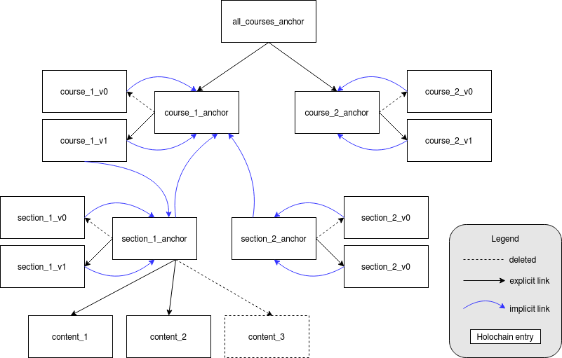

# devcamp7-leap

Leap (Learning Pathways) is a peer-to-peer Udemy inspired learning application built on Holochain.

This particular version of leap is built for the community-ran Holochain DevCamp 7.

See [Homework](./HOMEWORK.md) for guidelines related to DevCamp homework assignments.

## Development

### IDE / editor

There are multiple parts in this repository where the code is located:

- `dna/course/zomes/courses/code` contains Rust backend code
- `dna/course/test` contains backend integration tests

You can either open these directories manually or you can use `leap.code-workspace` file to open the Microsoft Visual Studio Code workspace that would:

- automatically open directories with zome code and integration tests;
- prompt you to install the recommended extensions if they're not already present;
- configure code formatting on each save for Rust files.

To open the workspace file, you can use two ways:

1. open Microsoft Visual Studio Code separately and then go to File > Open Workspace and select the `leap.code-workspace` file in the root of this repo. This would run Visual Studio outside of Holochain shell and it will be loading system level Rust tools
2. start Holochain shell in the root of this repository and inside it run `code .`. This will run Visual Studio inside the Holochain shell and it will be loading Rust tools provided by it.

#### working with rust-analyzer VSC extension

This is applicable for users of Microsoft Visual Studio Code.
There's a great extension [rust-analyzer](https://rust-analyzer.github.io/) that simplifies working with the code in many different ways. It requires build files to be present to work properly so we suggest to run `cargo build` in the `dna/course/zomes/courses/code/` directory to obtain them.
**NOTE**: if you're running on MacOS this command wouldn't succeed with a linker error due to reasons that we can't explain in detail here. Don't worry about it though because you would still able to build & package your application by running `hc package` from the `dna/course` directory.

### Building

All code building needs to be done in a Holochain shell which you can start by running the following command in this repository root:

```
nix-shell
```

**NOTE**: it is important to run `nix-shell` specifically from this repository root because it contains `config.nix` and `default.nix` files that define a fixed environment version. Using `holochain.love` shell would most likely lead to a version mismatch and potential errors.

If you don't have nix-shell installed, please refer to the [official doc](https://developer.holochain.org/docs/install/).

#### Package the entire DNA

This will build Rust project for every zome in DNA (we have just one) and then package it all into a Holochain format.

1. go to `dna/course`
2. run `hc package`

#### Build Rust project for a zome

This will just build a Rust project using Rust toolchain.

1. go to a zome directory `dna/course/zomes/courses/code`
2. run `cargo build`

**NOTE**: this command would fail with a linker error when running on MacOS. This is a known and expected issue and it just means you should be building using `hc package` command.

## User stories

* A user should be able to view 3 tabs: enrolled courses, my courses and all courses
* In enrolled courses, a user should be able to see all the courses in which the user is enrolled
* In my courses, a user should be able to see all the courses in which the user is the teacher, with a "Create course" button and a "Delete course" button, and an Edit button inlined
* In all courses, a user should be able to see all courses with an "Enrol" button if the user is not its teacher
* The teacher for a course should be able to create/edit/delete a section in the course from each course view inside "My courses" tab
* The teacher for a course should be able to create/edit/delete contents for each section from the section's view inside "My courses" tab
* The teacher for a course should be able to see all the students for that course

## Architecture


## Data model



